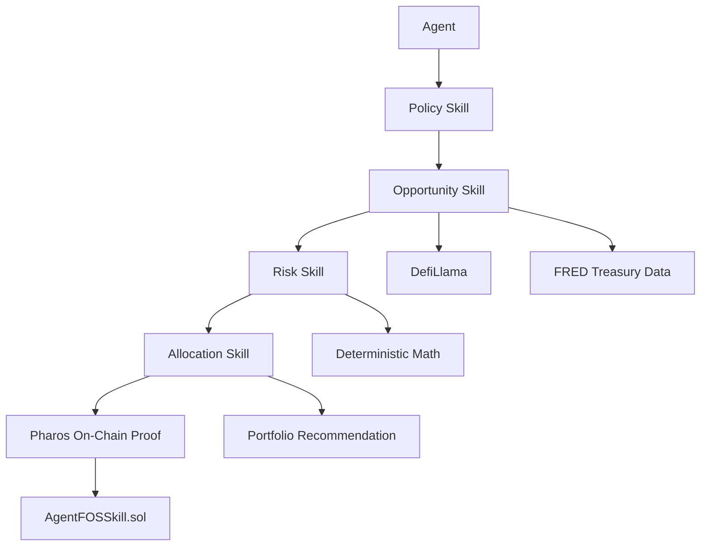

# AgentFOS

AgentFOS is the financial decision layer for autonomous agents.

It helps agents discover RWA opportunities, score protocol risk deterministically, enforce allocation policy, and record the top decision on Pharos with a payable on-chain proof.

## Problem

AI agents can reason and act, but they usually cannot make accountable financial decisions.

Most agent systems can summarize markets, suggest allocations, or draft instructions. Very few can:

- enforce a spend policy before capital moves
- score protocol risk with deterministic rules
- keep a verifiable record of the decision
- prove that a paid, on-chain action actually happened

That gap matters when agents are asked to manage real capital.

## Solution

AgentFOS turns agent intent into an auditable allocation pipeline:

1. An agent submits a policy-aware request.
2. AgentFOS discovers RWA opportunities.
3. AgentFOS scores each protocol with deterministic math.
4. AgentFOS builds a risk-adjusted allocation.
5. The top allocation is written on-chain to Pharos as proof.

The result is not a chatbot and not a portfolio tracker.

It is infrastructure for accountable financial decisions.

## Architecture



## Skills Overview

### Policy Skill

Enforces capital rules before a decision is allowed.

- spend limits
- risk tolerance
- asset allowlists

### Opportunity Skill

Finds RWA opportunities and benchmark context.

- protocol discovery
- APY and TVL enrichment
- Treasury rate comparison

### Risk Skill

Scores protocols deterministically.

- TVL
- protocol age
- audit status
- issuer concentration

### Allocation Skill

Combines policy, opportunity, and risk into a capital plan.

- risk-adjusted ranking
- allocation percentages
- portfolio summary

## On-Chain Proof

AgentFOS writes the top allocation to Pharos through a payable Solidity contract.

The contract:

- accepts allocation results from the backend
- stores risk scores per protocol
- stores the latest allocation tuple
- emits an `AllocationGenerated` event
- charges `0.001 PHRS` per `allocate(...)` call

Useful read commands:

```bash
cast call $AGENTFOS_CONTRACT_ADDRESS "getRiskScore(string)(uint256)" ondo --rpc-url $PHAROS_RPC_URL
cast call $AGENTFOS_CONTRACT_ADDRESS "getLastAllocation()(address,string,uint256,uint256,uint256)" --rpc-url $PHAROS_RPC_URL
```

## Demo Example

Run the app locally:

```bash
uvicorn main:app --reload
```

Open:

- [http://127.0.0.1:8000/app](http://127.0.0.1:8000/app)

Then submit a request to `POST /allocate` with capital and risk preferences.

Example request:

```bash
curl -sS -X POST http://127.0.0.1:8000/allocate \
  -H "Content-Type: application/json" \
  -d '{
    "capital": 100000,
    "risk": "medium",
    "min_apy_spread": 0
  }'
```

Expected result:

- portfolio metrics are returned immediately
- the top allocation is identified
- `onchain_status` reports whether the Pharos write succeeded, was skipped, or failed safely
- if successful, a tx hash is returned for PharosScan

## Why Pharos

Pharos fits this product because AgentFOS needs three things at once:

- native on-chain writes for accountability
- a clear testnet story for demos and judges
- a simple execution path for skill-style contracts and verifiable proof

AgentFOS does not need a general blockchain toolkit.

It needs a chain where a financial decision can be executed, stored, and inspected.

## Future Vision

AgentFOS starts with a curated RWA registry and a single paid allocation proof.

The long-term direction is broader agent infrastructure:

- more RWA protocols
- richer policy controls
- deeper on-chain audit trails
- reusable financial decision skills for other agent workflows

The product direction stays the same:

deterministic decisions, verifiable execution, and accountable capital.
