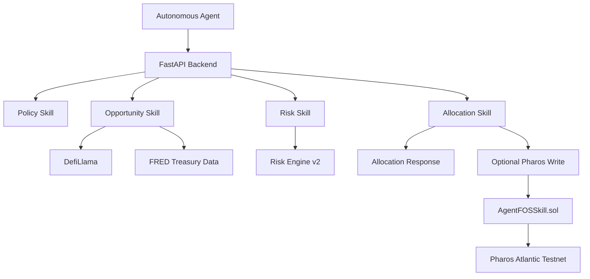

# Architecture

AgentFOS is a small, deterministic financial decision system.

## Backend

The backend is a FastAPI service that exposes `/policy`, `/opportunity`, `/risk`, `/allocate`, `/agent`, and `/health`.

## Skills

Skills are deterministic Python modules:

- `skills/policy.py`
- `skills/opportunity.py`
- `skills/risk.py`
- `skills/allocation.py`

## Risk Engine v2

Risk Engine v2 lives in `risk_engine_v2/`. It scores protocols across five dimensions and returns provenance for every dimension.

## Pharos Contract

`AgentFOSSkill.sol` stores protocol risk scores and the latest allocation on Pharos. The payable `allocate()` function charges `0.001 PHRS`.
