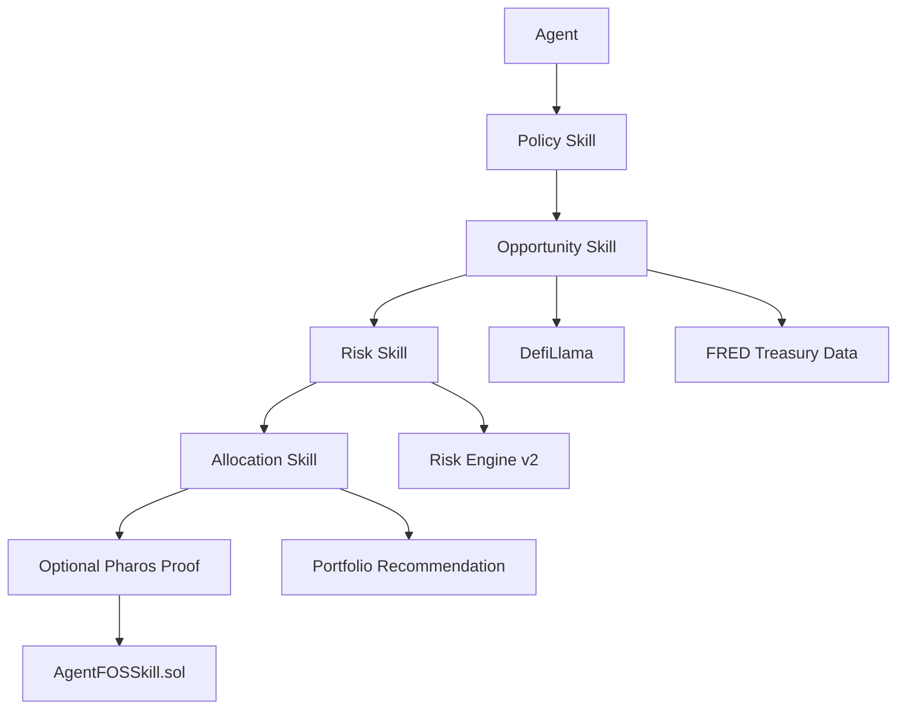

# AgentFOS

Every other agent knows what to buy.

AgentFOS decides if it should.

AgentFOS is the financial decision layer for autonomous agents. It helps agents discover RWA opportunities, score protocol risk deterministically, enforce allocation policy, generate allocation recommendations, and optionally record the top decision on Pharos with a payable on-chain proof.

> **What AgentFOS Is**
>
> AgentFOS is not an AI financial advisor.
>
> It is a financial decision layer that enables autonomous agents to participate safely in the RealFi economy.
>
> Decisions are deterministic, explainable, and can be proven on-chain via Pharos.

## 30-Second Mental Model

```text
Agent
↓
Policy Skill
↓
Opportunity Skill
↓
Risk Skill
↓
Allocation Skill
↓
Optional Pharos Proof
```

## The Problem

AI agents can reason and act, but they usually cannot make accountable financial decisions.

Most agent systems can summarize markets, suggest allocations, or draft instructions. Very few can enforce spend policy, score protocol risk with deterministic rules, keep a verifiable record of the decision, and prove that a paid on-chain action happened.

That gap matters when agents are asked to manage real capital.

## The Solution

AgentFOS turns agent intent into an auditable allocation pipeline:

1. An agent submits a policy-aware request.
2. AgentFOS discovers RWA opportunities.
3. AgentFOS scores each protocol with deterministic math.
4. AgentFOS builds a risk-adjusted allocation.
5. The top allocation can be written on-chain to Pharos as proof.

The result is not a chatbot and not a portfolio tracker. It is infrastructure for accountable financial decisions.

## Architecture



## Core Skills

| Skill | Purpose |
|---|---|
| Policy Skill | Enforces spend limits, risk tolerance, and asset allowlists |
| Opportunity Skill | Discovers RWA opportunities and benchmark context |
| Risk Skill | Scores protocols deterministically with Risk Engine v2 |
| Allocation Skill | Combines policy, opportunity, and risk into a capital plan |

## Why Pharos

Pharos fits AgentFOS because the product needs native on-chain writes for accountability, a clear testnet story for demos and judges, and a simple execution path for skill-style contracts and verifiable proof.

AgentFOS does not need a general blockchain toolkit. It needs a chain where a financial decision can be executed, stored, and inspected.

## Start Building

```python
import requests

response = requests.post(
    "https://agentfos.onrender.com/agent",
    json={
        "query": "Find low risk RWAs above treasury yields with $100k capital"
    }
)

print(response.json())
```

Next: [Quickstart](/getting-started/quickstart)
